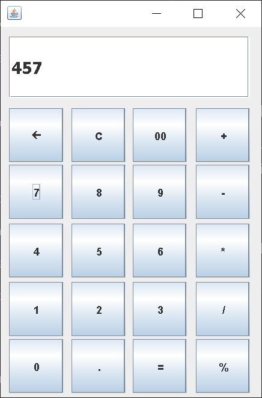

# 🧮 Java Swing Calculator

A modern calculator built using **Java Swing** and **AWT** — designed for simplicity, accuracy, and speed.

## 🚀 Features
- Clean and responsive UI
- Basic operations: ➕ ➖ ✖️ ➗ %
- Backspace and clear functionality
- Works on any Java-supported system

## 🖼️ UI Preview



## ⚙️ How to Run
1. Clone this repository:
   ```bash
   git clone https://github.com/yourusername/Calculator.git
